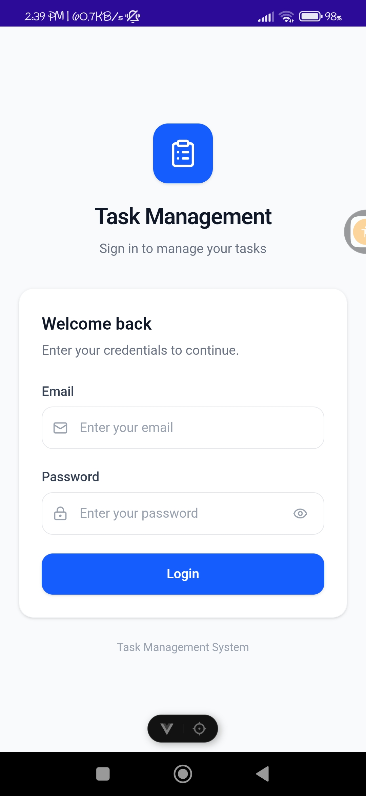
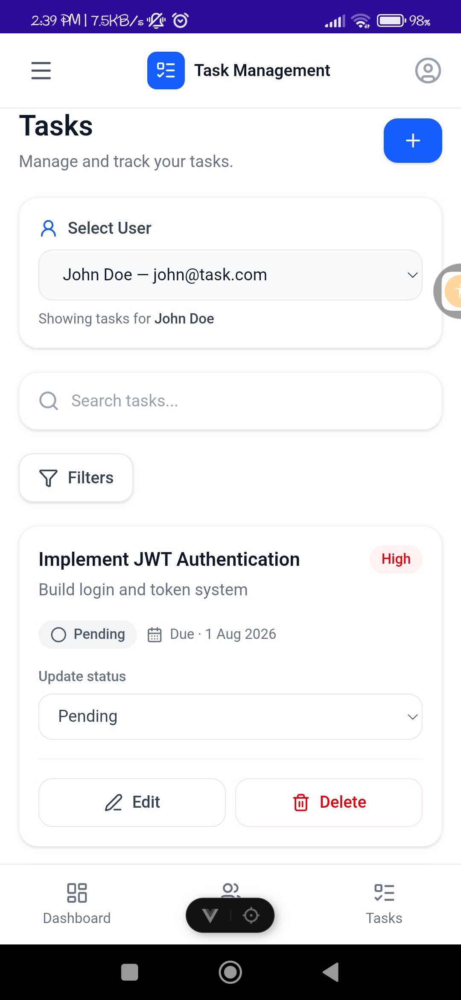
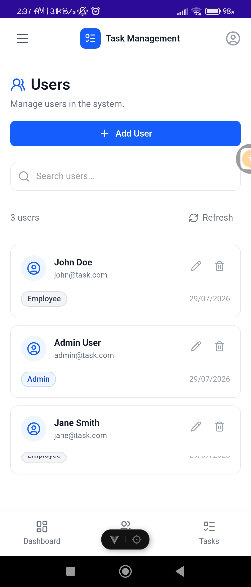
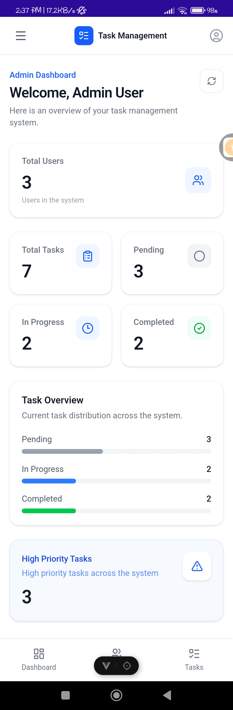

# Task Management System

A full-stack Task Management System developed as an internship assignment. The application provides task and user management through a RESTful ASP.NET Core API, a Vue.js web application, and a .NET MAUI mobile application using WebView integration.

The system implements JWT authentication, role-based authorization, user-specific task management, administrative task management, dashboard statistics, and a responsive web interface designed to work well within the mobile application.

<p align="center">
  
  
</p>

<p align="center">
  
  
</p>

---

## Project Overview

The Task Management System consists of three main components:

- **Backend API** – ASP.NET Core Web API using ADO.NET and raw SQL
- **Web Frontend** – Vue.js application using TypeScript and Tailwind CSS
- **Mobile Application** – .NET MAUI application using WebView to host the web frontend

The system supports two user roles:

- **Admin**
- **Employee**

Administrators can manage users and manage tasks belonging to different users, while employees can manage and view their own tasks.

---

## Features

### User Management

Administrators can:

- View all users
- Search and filter users
- Create new users
- Edit existing users
- Delete users
- View user information
- Assign user roles

### Task Management

Users can:

- View their tasks
- Create tasks
- Edit tasks
- Update task status
- Delete tasks
- Search tasks
- Filter tasks by:
  - User
  - Status
  - Priority
  - Due date

Administrators additionally have the ability to:

- View tasks belonging to other users
- Create tasks for other users
- Update tasks belonging to other users
- Delete tasks belonging to other users

### Task Statuses

Tasks support the following statuses:

- Pending
- In Progress
- Completed

### Task Priorities

Tasks support:

- Low
- Medium
- High

### Authentication

The application implements:

- JWT-based authentication
- Login endpoint
- Token generation
- Protected API endpoints
- Role-based authorization
- Admin-only endpoints

### Dashboard

The dashboard provides different information depending on the logged-in user's role.

#### Employee Dashboard

Displays:

- Total number of personal tasks
- Pending tasks
- In Progress tasks
- Completed tasks
- High-priority tasks

#### Admin Dashboard

Displays:

- Total number of users
- Total number of tasks
- Pending tasks
- In Progress tasks
- Completed tasks
- High-priority tasks

### Web Application

The Vue.js frontend provides:

- Login page
- Dashboard
- User management
- Task management
- User selection and task filtering
- Task search and filtering
- Task creation and editing modals
- User creation and editing modals
- Task status updates
- Task deletion
- User deletion
- Loading states
- Error handling
- Responsive/mobile-friendly UI

The interface follows a minimal design approach using a predominantly white interface with blue accents.

### Mobile Application

The .NET MAUI application provides:

- Native mobile application shell
- WebView integration
- Vue.js web application hosted inside the WebView
- Native splash screen
- WebView loading state
- Network/loading error handling
- Retry functionality
- Back-button handling
- Navigation between WebView content and native pages

---

## Technology Stack

### Backend

- ASP.NET Core Web API
- C#
- .NET
- ADO.NET
- Microsoft SQL Server
- JWT Authentication
- Dependency Injection
- REST APIs

### Frontend

- Vue.js
- TypeScript
- Vite
- Tailwind CSS
- Pinia
- Vue Router
- Axios
- Lucide Icons

### Mobile

- .NET MAUI
- C#
- XAML
- WebView
- Android

### Development Tools

- Visual Studio Code
- Visual Studio
- SQL Server
- Postman
- Git
- GitHub

---

## Project Structure

The source code is organized under the `src` directory.

```text
TaskManagement/
│
├── src/
│   │
│   ├── task-management-client/
│   │   ├── src/
│   │   │   ├── components/
│   │   │   ├── layouts/
│   │   │   ├── router/
│   │   │   ├── services/
│   │   │   ├── stores/
│   │   │   ├── types/
│   │   │   └── views/
│   │   │
│   │   ├── package.json
│   │   └── vite.config.ts
│   │
│   ├── TaskManagement/
│   │   ├── TaskManagement.Api/
│   │   ├── TaskManagement.Application/
│   │   ├── TaskManagement.Domain/
│   │   └── TaskManagement.Infrastructure/
│   │
│   └── TaskManagement.Mobile/
│       ├── Platforms/
│       ├── Resources/
│       ├── MainPage.xaml
│       ├── MainPage.xaml.cs
│       ├── App.xaml
│       └── MauiProgram.cs
│
├── README.md
└── ...
```

The backend follows a layered architecture separating API, application logic, domain entities, and infrastructure/database operations.

---

# Backend Architecture

The backend is structured into multiple layers.

```text
TaskManagement.Api
        │
        ▼
TaskManagement.Application
        │
        ▼
TaskManagement.Domain
        │
        ▼
TaskManagement.Infrastructure
        │
        ▼
    SQL Server
```

### API Layer

Responsible for:

- Controllers
- HTTP requests/responses
- Authentication and authorization
- API routing

### Application Layer

Responsible for:

- Services
- DTOs
- Mapping
- Business logic
- Application contracts

### Domain Layer

Responsible for:

- Domain entities
- Enums
- Core domain definitions

### Infrastructure Layer

Responsible for:

- ADO.NET database operations
- Repositories
- SQL query execution
- SQL query management
- Database mapping

---

# Database

The application uses Microsoft SQL Server.

The main tables are:

### Users

| Column       | Description           |
| ------------ | --------------------- |
| Id           | Primary key           |
| Name         | User's name           |
| Email        | User's email          |
| PasswordHash | Hashed password       |
| Role         | User role             |
| CreatedDate  | Account creation date |

### Tasks

| Column      | Description        |
| ----------- | ------------------ |
| Id          | Primary key        |
| Title       | Task title         |
| Description | Task description   |
| Status      | Task status        |
| Priority    | Task priority      |
| UserId      | Assigned user      |
| CreatedDate | Task creation date |
| DueDate     | Task due date      |
| UpdatedDate | Last update date   |

The relationship between the tables is:

```text
Users
  │
  │ 1
  │
  │
  │ *
Tasks
```

Each task belongs to a user.

---

# SQL Query Management

SQL queries are maintained separately from the repository implementation.

The infrastructure layer retrieves SQL statements through the query management service instead of embedding SQL directly inside repository methods.

This provides:

- Separation of SQL from application code
- Improved maintainability
- Centralized query management
- Cleaner repository implementations

---

# Authentication

The application uses JWT authentication.

The authentication flow is:

```text
User
 │
 ▼
Login Page
 │
 ▼
POST /api/auth/login
 │
 ▼
Authentication Service
 │
 ▼
Validate Credentials
 │
 ▼
Generate JWT
 │
 ▼
Return Token
 │
 ▼
Vue Application
 │
 ▼
Authorization: Bearer <token>
 │
 ▼
Protected API
```

The JWT contains the information required by the backend to identify the current user and determine their role.

Role-based authorization is used to restrict administrative operations.

---

# API Endpoints

The backend exposes the following REST APIs.

## Authentication

### Login

```http
POST /api/auth/login
```

Request:

```json
{
  "email": "admin@example.com",
  "password": "Password123"
}
```

Response:

```json
{
  "token": "JWT_TOKEN",
  "expiresAt": "2026-..."
}
```

---

## Users

All user management endpoints require the **Admin** role.

### Get All Users

```http
GET /api/user
```

### Get User

```http
GET /api/user/{id}
```

### Create User

```http
POST /api/user
```

Example:

```json
{
  "name": "John Doe",
  "email": "john@example.com",
  "password": "Password123",
  "role": 2
}
```

Role values:

```text
1 = Admin
2 = Employee
```

### Update User

```http
PUT /api/user/{id}
```

Example:

```json
{
  "name": "John Doe Updated",
  "email": "john@example.com",
  "role": 2
}
```

### Delete User

```http
DELETE /api/user/{id}
```

---

# Tasks

### Get My Tasks

Returns tasks belonging to the authenticated user.

```http
GET /api/tasks
```

### Get Task By ID

```http
GET /api/tasks/{id}
```

### Get Tasks By User

Admin-only endpoint.

```http
GET /api/tasks/user/{userId}
```

### Create Task

```http
POST /api/tasks
```

Example:

```json
{
  "title": "Complete project documentation",
  "description": "Prepare the final documentation.",
  "status": 0,
  "priority": 2,
  "dueDate": "2026-08-15T00:00:00",
  "userId": 2
}
```

For administrators, `userId` can be used to assign the task to another user.

### Update Task

```http
PUT /api/tasks/{id}
```

### Update Task Status

```http
PATCH /api/tasks/{id}/status
```

Example:

```json
2
```

Status values:

```text
0 = Pending
1 = In Progress
2 = Completed
```

### Delete Task

```http
DELETE /api/tasks/{id}
```

---

# Dashboard

The dashboard endpoint is protected and determines the appropriate statistics based on the authenticated user's role.

```http
GET /api/dashboard
```

Example response:

```json
{
  "totalUsers": 5,
  "totalTasks": 20,
  "pendingTasks": 7,
  "inProgressTasks": 6,
  "completedTasks": 7,
  "highPriorityTasks": 4
}
```

For employees, the task statistics represent their own tasks.

For administrators, the statistics represent the entire system.

---

# Running the Project

## Prerequisites

Install the following before running the project:

- .NET SDK
- Node.js
- npm
- SQL Server
- SQL Server Management Studio or another SQL client
- Postman
- Android SDK / Android tooling for the mobile application

---

# 1. Database Setup

Create a SQL Server database for the application.

Run the database scripts included in the repository to create:

- Users table
- Tasks table
- Required relationships
- Initial data, if provided

Update the backend connection string in the appropriate configuration file.

Example:

```json
{
  "ConnectionStrings": {
    "DefaultConnection": "YOUR_CONNECTION_STRING"
  }
}
```

Do not commit production credentials or sensitive connection strings to the repository.

---

# 2. Run the Backend

Navigate to the backend project:

```bash
cd src/TaskManagement
```

Restore dependencies:

```bash
dotnet restore
```

Run the API:

```bash
dotnet run
```

The API will start on the configured HTTP/HTTPS ports.

For example:

```text
http://localhost:5055
https://localhost:7161
```

The exact ports may vary depending on the local configuration.

---

# 3. Run the Vue Frontend

Navigate to the frontend:

```bash
cd src/task-management-client
```

Install dependencies:

```bash
npm install
```

Start the development server:

```bash
npm run dev
```

The Vite development server will normally be available at:

```text
http://localhost:5173
```

The frontend API configuration should point to the running ASP.NET Core backend.

For example, a Vite environment variable can be configured as:

```text
VITE_API_BASE_URL=http://localhost:5055/api
```

The actual value should match the backend address being used.

---

# 4. Run the Mobile Application

The mobile application is located at:

```text
src/TaskManagement.Mobile
```

The current implementation uses a .NET MAUI WebView to load the Vue.js frontend.

Before launching the mobile application:

1. Start the ASP.NET Core backend.
2. Start the Vue development server.
3. Make the Vue development server accessible from the mobile device.
4. Ensure the phone and development computer are connected to the same network.
5. Configure the WebView URL to use the development computer's local network IP address.
6. Run the MAUI Android application on the connected Android device.

Example:

```text
http://192.168.x.x:5173
```

The IP address must be replaced with the local IP address of the development computer.

The mobile application also provides loading and error states around the WebView and supports retrying when the web application cannot be loaded.

---

# Postman Collection

A Postman collection is included as part of the project deliverables.

The collection contains requests for:

- Authentication
- Dashboard
- User management
- Task management

The login request stores the returned JWT token for use by subsequent authenticated requests.

Recommended demonstration flow:

```text
Login
  ↓
Get Dashboard
  ↓
Get All Users
  ↓
Create User
  ↓
Update User
  ↓
Create Task
  ↓
Get Tasks
  ↓
Update Task
  ↓
Update Task Status
  ↓
Delete Task
```

---

# Authorization Model

The system uses role-based access control.

### Employee

Employees can:

- Login
- View their dashboard
- View their tasks
- Create their own tasks
- Update their tasks
- Update task status
- Delete their tasks

### Admin

Administrators can additionally:

- View all users
- Create users
- Update users
- Delete users
- View tasks belonging to other users
- Create tasks for other users
- Update tasks belonging to other users
- Delete tasks belonging to other users
- View system-wide dashboard statistics

---

# Frontend Architecture

The Vue application follows a component-based structure.

```text
src/
│
├── components/
│   ├── common/
│   ├── tasks/
│   └── users/
│
├── layouts/
│
├── router/
│
├── services/
│
├── stores/
│
├── types/
│
└── views/
```

### Components

Reusable UI components for users, tasks, forms, modals, and common interface elements.

### Services

Responsible for communication with the backend API.

### Stores

Pinia stores are used for application state such as authentication and user selection.

### Router

Vue Router manages navigation and route protection.

Protected routes require authentication, while administrative routes additionally require the Admin role.

---

# Mobile Architecture

The mobile application uses a hybrid approach.

```text
.NET MAUI Application
        │
        ▼
     WebView
        │
        ▼
Vue.js Web Application
        │
        ▼
ASP.NET Core API
        │
        ▼
SQL Server
```

This approach allows the existing responsive Vue.js application to be reused inside the mobile application while still providing native .NET MAUI functionality where required.

The MAUI application handles:

- Application startup
- Native splash screen
- WebView loading
- Loading indicators
- WebView errors
- Retry functionality
- Back-button behavior
- Navigation to native pages

---

# Error Handling

The application includes error handling across the different layers.

### Backend

API endpoints return appropriate HTTP responses such as:

- `200 OK`
- `201 Created`
- `204 No Content`
- `401 Unauthorized`
- `404 Not Found`

### Frontend

The Vue application displays appropriate error messages for:

- Failed API requests
- Login failures
- Failed task operations
- Failed user operations
- Loading failures

### Mobile

The MAUI WebView displays an error state when the web application cannot be loaded and provides a retry option.

---

# Assignment Requirements Coverage

| Requirement                   | Implementation            |
| ----------------------------- | ------------------------- |
| User management               | ASP.NET Core API + Vue UI |
| Add user                      | Implemented               |
| View users                    | Implemented               |
| Task creation                 | Implemented               |
| View tasks by user            | Implemented               |
| Update task status            | Implemented               |
| Delete task                   | Implemented               |
| Pending status                | Implemented               |
| In Progress status            | Implemented               |
| Completed status              | Implemented               |
| JWT authentication            | Implemented               |
| Login endpoint                | Implemented               |
| Protected APIs                | Implemented               |
| Role-based authorization      | Implemented               |
| Vue frontend                  | Implemented               |
| User selection                | Implemented               |
| Task filtering                | Implemented               |
| Task search                   | Implemented               |
| Status filtering              | Implemented               |
| Priority filtering            | Implemented               |
| Due-date filtering            | Implemented               |
| Task creation form            | Implemented               |
| Task editing                  | Implemented               |
| User management UI            | Implemented               |
| Dashboard                     | Implemented               |
| .NET MAUI application         | Implemented               |
| WebView integration           | Implemented               |
| Native loading/error handling | Implemented               |
| Back-button handling          | Implemented               |
| Postman API collection        | Included                  |

---

# Learning Outcomes

This project demonstrates practical experience with:

- REST API development
- ASP.NET Core
- C#
- Layered application architecture
- Dependency injection
- JWT authentication
- Role-based authorization
- ADO.NET
- Raw SQL
- SQL query separation
- Repository and service patterns
- DTO-based API communication
- Vue.js
- TypeScript
- Tailwind CSS
- Pinia state management
- Vue Router
- Axios API integration
- Responsive UI development
- .NET MAUI
- WebView-based hybrid applications
- API testing with Postman
- Git and GitHub

---

# Project Status

The core Task Management System is implemented across the backend, web frontend, and mobile application.

The project is intended as an internship assignment and demonstration project rather than a production deployment.

The application is designed to be run locally with the backend API, Vue development server, SQL Server database, and .NET MAUI Android application.

---

# Author

Developed as part of a Software Engineering internship assignment.
